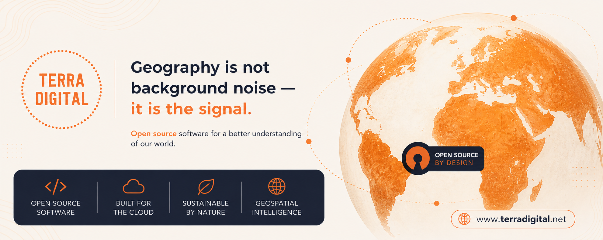

# 🌍 Terra Digital

> *Geography is not background noise — it is the signal.*

---

<!-- ===================== -->
<!-- BANNER (ALTERAR AQUI) -->
<!-- ===================== -->

> 🔧 Substituir `assets/banner.png` pelo teu ficheiro de banner atual  
> (podes também usar um link externo ou outro nome de ficheiro)

---

## 🚀 Sobre o Projeto

**Terra Digital** é uma iniciativa focada em transformar dados geoespaciais em soluções inteligentes, abertas e aplicadas ao mundo real.

Trabalhamos com:
- 🌐 Sistemas de Informação Geográfica (GIS)
- 🛰️ Observação da Terra e Remote Sensing
- 🧠 Análise espacial avançada
- 🧩 Automação geoespacial
- 🌱 Soluções sustentáveis baseadas em dados

---

## 🧰 Tecnologias Principais

- Python (GeoPandas, Pandas, Rasterio)
- QGIS & PyQGIS
- Google Earth Engine (GEE)
- PostGIS / PostgreSQL
- GDAL / OGR
- Leaflet / Mapbox
- R (análise espacial e estatística)

---

## 🌍 Filosofia

> Open data. Open tools. Real impact.

O Terra Digital promove:
- Software open source
- Transparência de dados
- Reprodutibilidade científica
- Acesso livre ao conhecimento geoespacial

---

## 📊 Áreas de Atuação

- 🌦️ Climatologia e dados ambientais
- 🌾 Agricultura de precisão
- 🏙️ Planeamento urbano
- 🌊 Monitorização costeira
- 🔥 Risco e incêndios florestais
- 🌳 Sustentabilidade e biodiversidade

---

## 📁 Estrutura do Repositório (sugestão)
/assets → imagens, banners, logos
/scripts → automações Python / R
/notebooks → análise exploratória
/docs → documentação técnica
/data → datasets (ou links)
/maps → outputs cartográficos

---

## 🧭 Objetivo

Criar um ecossistema open source onde:
- dados geoespaciais são acessíveis
- análises são reproduzíveis
- e decisões são baseadas em evidência espacial

---

## 📬 Contacto

Terra Digital Initiative  
GIS • Remote Sensing • Open Source
